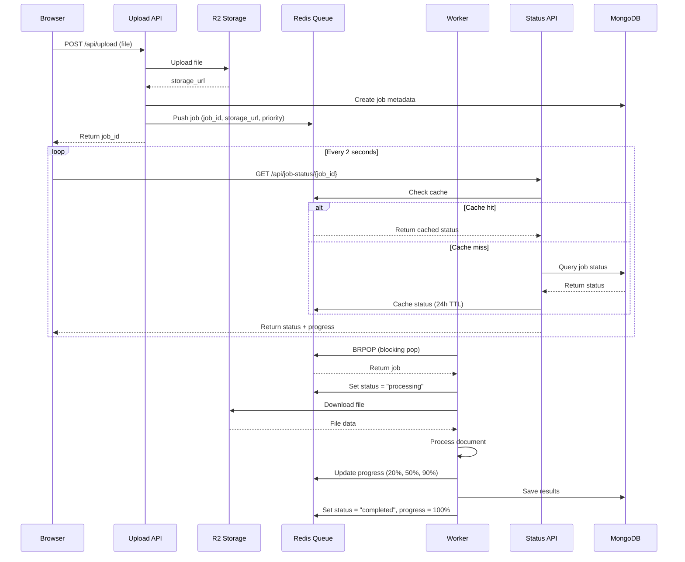

# Design Document: Async Queue Architecture

## Overview

The async queue architecture decouples file upload from document processing using a queue-based system. This design eliminates timeout issues, enables horizontal scaling, and provides real-time progress tracking. The architecture consists of five main components: Upload API (Vercel), Storage Service (Cloudflare R2), Queue System (Upstash Redis), Worker processes (Railway), and Status API (Vercel).

The key insight is that by returning a Job_ID immediately after upload and processing asynchronously, we eliminate the 60-second timeout constraint while providing users with real-time progress updates through polling.

## Architecture

### High-Level Flow

```
┌─────────┐
│ Browser │
└────┬────┘
     │ 1. Upload file (POST /api/upload)
     ▼
┌─────────────┐
│ Upload API  │ (Vercel)
│             │ 2. Store file in R2
│             │ 3. Create job in MongoDB
│             │ 4. Push job to Redis queue
└─────┬───────┘
      │ 5. Return job_id
      ▼
┌─────────────┐
│   Browser   │ 6. Poll status every 2s (GET /api/job-status/{job_id})
└─────┬───────┘
      │
      ▼
┌─────────────┐         ┌──────────────┐
│ Status API  │◄────────┤ Redis Cache  │
│             │         │ (24h TTL)    │
└─────┬───────┘         └──────────────┘
      │
      ▼
┌─────────────┐
│  MongoDB    │
└─────────────┘

Meanwhile, asynchronously:

┌──────────────┐         ┌─────────────┐
│ Redis Queue  │◄────────┤   Worker    │ (Railway)
│              │ BRPOP   │             │
└──────────────┘         │ 7. Pull job │
                         │ 8. Download │
                         │ 9. Process  │
                         │ 10. Update  │
                         └─────┬───────┘
                               │
                               ▼
                         ┌─────────────┐
                         │  MongoDB    │
                         │  + Redis    │
                         └─────────────┘
```

### Component Interaction

1. **Upload Phase**: Browser → Upload API → R2 Storage + Redis Queue → Return job_id (< 1 second)
2. **Processing Phase**: Worker → Redis Queue (BRPOP) → Download from R2 → Process → Update Redis + MongoDB
3. **Status Phase**: Browser → Status API → Redis Cache → MongoDB (if cache miss) → Return status + progress

### Data Flow



## Components and Interfaces

### 1. Upload API (Vercel - TypeScript/Next.js)

**Endpoint**: `POST /api/upload`

**Request**:
```typescript
// multipart/form-data
{
  file: File,           // Max 50MB
  userId: string,       // From auth token
  priority?: number     // Optional, default 0 (premium users get higher)
}
```

**Response**:
```typescript
{
  success: boolean,
  jobId: string,        // UUID v4
  message: string,
  estimatedTime?: number // Estimated processing time in seconds
}
```

**Implementation**:
```typescript
async function handleUpload(req: Request): Promise<Response> {
  // 1. Validate authentication
  const user = await validateAuth(req);
  
  // 2. Validate file size (max 50MB)
  const file = await req.formData().get('file');
  if (file.size > 50 * 1024 * 1024) {
    return error('File too large');
  }
  
  // 3. Generate job_id
  const jobId = uuidv4();
  
  // 4. Upload to R2 with retry
  const storageUrl = await uploadToR2(file, jobId, { retries: 3 });
  
  // 5. Create job metadata in MongoDB
  await createJob({
    jobId,
    userId: user.id,
    filename: file.name,
    fileSize: file.size,
    storageUrl,
    status: 'queued',
    priority: user.isPremium ? 10 : 0,
    createdAt: new Date(),
    retryCount: 0
  });
  
  // 6. Push to Redis queue
  await pushToQueue({
    jobId,
    storageUrl,
    priority: user.isPremium ? 10 : 0
  });
  
  // 7. Return job_id immediately
  return success({ jobId, estimatedTime: estimateProcessingTime(file.size) });
}
```

**Error Handling**:
- File too large (>50MB): Return 413 Payload Too Large
- Storage upload fails after 3 retries: Return 503 Service Unavailable
- Redis unavailable: Return 503 Service Unavailable
- MongoDB unavailable: Return 503 Service Unavailable

### 2. Storage Service (Cloudflare R2)

**Configuration**:
```typescript
const r2Config = {
  accountId: process.env.R2_ACCOUNT_ID,
  accessKeyId: process.env.R2_ACCESS_KEY_ID,
  secretAccessKey: process.env.R2_SECRET_ACCESS_KEY,
  bucket: 'document-uploads',
  region: 'auto'
};
```

**Operations**:
```typescript
// Upload with signed URL generation
async function uploadToR2(
  file: File, 
  jobId: string, 
  options: { retries: number }
): Promise<string> {
  const key = `uploads/${jobId}/${file.name}`;
  
  for (let i = 0; i < options.retries; i++) {
    try {
      await r2Client.putObject({
        Bucket: r2Config.bucket,
        Key: key,
        Body: file.stream(),
        ContentType: file.type
      });
      
      // Generate signed URL (valid for 7 days)
      const signedUrl = await r2Client.getSignedUrl('getObject', {
        Bucket: r2Config.bucket,
        Key: key,
        Expires: 7 * 24 * 60 * 60 // 7 days
      });
      
      return signedUrl;
    } catch (error) {
      if (i === options.retries - 1) throw error;
      await sleep(Math.pow(2, i) * 1000); // Exponential backoff
    }
  }
}

// Download (used by Worker)
async function downloadFromR2(signedUrl: string): Promise<Buffer> {
  const response = await fetch(signedUrl);
  if (!response.ok) throw new Error('Download failed');
  return Buffer.from(await response.arrayBuffer());
}
```

### 3. Queue System (Upstash Redis)

**Configuration**:
```typescript
const redisConfig = {
  url: process.env.UPSTASH_REDIS_URL,
  token: process.env.UPSTASH_REDIS_TOKEN
};

const redis = new Redis(redisConfig);
```

**Queue Operations**:
```typescript
// Push job to priority queue
async function pushToQueue(job: Job): Promise<void> {
  // Use sorted set for priority queue (score = priority)
  await redis.zadd('job_queue', {
    score: job.priority,
    member: JSON.stringify({
      jobId: job.jobId,
      storageUrl: job.storageUrl,
      priority: job.priority,
      queuedAt: Date.now()
    })
  });
  
  // Set initial status
  await redis.setex(
    `job:${job.jobId}:status`,
    24 * 60 * 60, // 24 hours TTL
    JSON.stringify({
      status: 'queued',
      progress: 0,
      queuedAt: Date.now()
    })
  );
}

// Pop highest priority job (blocking)
async function popFromQueue(timeout: number = 5): Promise<Job | null> {
  // Use ZPOPMAX for priority queue (highest score first)
  const result = await redis.zpopmax('job_queue');
  
  if (!result || result.length === 0) {
    // If queue empty, wait with BRPOP on a notification key
    await redis.brpop('job_notification', timeout);
    return popFromQueue(0); // Try again immediately
  }
  
  const [jobData, priority] = result;
  return JSON.parse(jobData as string);
}

// Update job status
async function updateJobStatus(
  jobId: string,
  status: JobStatus,
  progress: number,
  data?: any
): Promise<void> {
  await redis.setex(
    `job:${jobId}:status`,
    24 * 60 * 60, // 24 hours TTL
    JSON.stringify({
      status,
      progress,
      updatedAt: Date.now(),
      ...data
    })
  );
}

// Get job status
async function getJobStatus(jobId: string): Promise<JobStatus | null> {
  const data = await redis.get(`job:${jobId}:status`);
  return data ? JSON.parse(data) : null;
}
```

**Status Cache Structure**:
```typescript
interface CachedJobStatus {
  status: 'queued' | 'processing' | 'completed' | 'failed';
  progress: number; // 0-100
  queuedAt?: number;
  startedAt?: number;
  completedAt?: number;
  error?: string;
  result?: any;
}
```

### 4. Worker Process (Railway - Python)

**Main Loop**:
```python
import redis
import boto3
import time
from typing import Optional, Dict

class DocumentWorker:
    def __init__(self):
        self.redis = redis.from_url(os.environ['UPSTASH_REDIS_URL'])
        self.r2_client = boto3.client('s3', 
            endpoint_url=os.environ['R2_ENDPOINT'],
            aws_access_key_id=os.environ['R2_ACCESS_KEY_ID'],
            aws_secret_access_key=os.environ['R2_SECRET_ACCESS_KEY']
        )
        self.mongo = MongoClient(os.environ['MONGODB_URI'])
        self.db = self.mongo['production']
    
    def run(self):
        """Main worker loop"""
        print("Worker started, waiting for jobs...")
        
        while True:
            try:
                # Pop job from queue (blocking, 5 second timeout)
                job = self.pop_job(timeout=5)
                
                if job:
                    self.process_job(job)
                    
            except Exception as e:
                print(f"Worker error: {e}")
                time.sleep(1)  # Brief pause before retry
    
    def pop_job(self, timeout: int = 5) -> Optional[Dict]:
        """Pop highest priority job from queue"""
        # Use ZPOPMAX for priority queue
        result = self.redis.zpopmax('job_queue', count=1)
        
        if not result:
            # Wait for notification
            self.redis.brpop('job_notification', timeout=timeout)
            return None
        
        job_data, priority = result[0]
        return json.loads(job_data)
    
    def process_job(self, job: Dict):
        """Process a single job"""
        job_id = job['jobId']
        
        try:
            # Update status to processing
            self.update_status(job_id, 'processing', 0)
            self.update_mongo_status(job_id, 'processing')
            
            # Download file from R2
            print(f"Downloading file for job {job_id}")
            file_data = self.download_file(job['storageUrl'])
            self.update_status(job_id, 'processing', 20)
            
            # Process document
            print(f"Processing document for job {job_id}")
            result = self.process_document(file_data, job_id)
            self.update_status(job_id, 'processing', 90)
            
            # Save results
            print(f"Saving results for job {job_id}")
            self.save_results(job_id, result)
            
            # Mark complete
            self.update_status(job_id, 'completed', 100, {'result': result})
            self.update_mongo_status(job_id, 'completed', result)
            
            print(f"Job {job_id} completed successfully")
            
        except Exception as e:
            print(f"Job {job_id} failed: {e}")
            self.handle_failure(job, str(e))
    
    def download_file(self, signed_url: str) -> bytes:
        """Download file from R2 using signed URL"""
        response = requests.get(signed_url)
        response.raise_for_status()
        return response.content
    
    def process_document(self, file_data: bytes, job_id: str) -> Dict:
        """Process document - this is where the actual work happens"""
        # Update progress periodically
        self.update_status(job_id, 'processing', 30)
        
        # Extract text
        text = extract_text(file_data)
        self.update_status(job_id, 'processing', 50)
        
        # Generate vocabulary
        vocabulary = generate_vocabulary(text)
        self.update_status(job_id, 'processing', 70)
        
        # Generate flashcards
        flashcards = generate_flashcards(text, vocabulary)
        self.update_status(job_id, 'processing', 85)
        
        return {
            'vocabulary': vocabulary,
            'flashcards': flashcards,
            'wordCount': len(text.split())
        }
    
    def update_status(self, job_id: str, status: str, progress: int, data: Dict = None):
        """Update job status in Redis"""
        status_data = {
            'status': status,
            'progress': progress,
            'updatedAt': int(time.time() * 1000)
        }
        if data:
            status_data.update(data)
        
        self.redis.setex(
            f'job:{job_id}:status',
            24 * 60 * 60,  # 24 hours
            json.dumps(status_data)
        )
    
    def update_mongo_status(self, job_id: str, status: str, result: Dict = None):
        """Update job status in MongoDB"""
        update = {
            'status': status,
            'updatedAt': datetime.utcnow()
        }
        
        if status == 'processing':
            update['startedAt'] = datetime.utcnow()
        elif status == 'completed':
            update['completedAt'] = datetime.utcnow()
            if result:
                update['result'] = result
        
        self.db.jobs.update_one(
            {'jobId': job_id},
            {'$set': update}
        )
    
    def save_results(self, job_id: str, result: Dict):
        """Save processing results to MongoDB"""
        self.db.results.insert_one({
            'jobId': job_id,
            'result': result,
            'createdAt': datetime.utcnow()
        })
    
    def handle_failure(self, job: Dict, error: str):
        """Handle job failure with retry logic"""
        job_id = job['jobId']
        
        # Get current retry count
        job_doc = self.db.jobs.find_one({'jobId': job_id})
        retry_count = job_doc.get('retryCount', 0) + 1
        
        # Log error
        self.db.errors.insert_one({
            'jobId': job_id,
            'error': error,
            'retryCount': retry_count,
            'timestamp': datetime.utcnow()
        })
        
        if retry_count < 3:
            # Re-queue job
            print(f"Re-queuing job {job_id} (attempt {retry_count + 1}/3)")
            self.redis.zadd('job_queue', {
                json.dumps(job): job.get('priority', 0)
            })
            self.db.jobs.update_one(
                {'jobId': job_id},
                {'$set': {'retryCount': retry_count, 'status': 'queued'}}
            )
            self.update_status(job_id, 'queued', 0)
        else:
            # Mark as permanently failed
            print(f"Job {job_id} failed permanently after 3 attempts")
            self.update_status(job_id, 'failed', 0, {'error': error})
            self.db.jobs.update_one(
                {'jobId': job_id},
                {'$set': {'status': 'failed', 'error': error}}
            )
            # Send notification (implement based on requirements)
            self.send_failure_notification(job_id, error)
    
    def send_failure_notification(self, job_id: str, error: str):
        """Send notification for permanent failure"""
        # Implement notification logic (email, webhook, etc.)
        pass

if __name__ == '__main__':
    worker = DocumentWorker()
    worker.run()
```

**Deployment Configuration** (Railway):
```toml
# railway.toml
[build]
builder = "NIXPACKS"

[deploy]
startCommand = "python worker.py"
restartPolicyType = "ON_FAILURE"
restartPolicyMaxRetries = 10

[[services]]
name = "worker"
instances = 2  # Start with 2 workers, scale as needed
```

### 5. Status API (Vercel - TypeScript/Next.js)

**Endpoint**: `GET /api/job-status/[jobId]`

**Response**:
```typescript
{
  success: boolean,
  status: 'queued' | 'processing' | 'completed' | 'failed',
  progress: number,  // 0-100
  queuedAt?: number,
  startedAt?: number,
  completedAt?: number,
  processingTime?: number,  // milliseconds
  result?: {
    vocabulary: Array<any>,
    flashcards: Array<any>,
    wordCount: number
  },
  error?: string
}
```

**Implementation**:
```typescript
async function getJobStatus(jobId: string, userId: string): Promise<Response> {
  // 1. Validate authentication and ownership
  const user = await validateAuth();
  const job = await db.jobs.findOne({ jobId });
  
  if (!job) {
    return error('Job not found', 404);
  }
  
  if (job.userId !== userId) {
    return error('Unauthorized', 403);
  }
  
  // 2. Check Redis cache first
  const cachedStatus = await redis.get(`job:${jobId}:status`);
  
  if (cachedStatus) {
    return success(JSON.parse(cachedStatus));
  }
  
  // 3. Cache miss - query MongoDB
  const jobData = await db.jobs.findOne({ jobId });
  const resultData = await db.results.findOne({ jobId });
  
  const status = {
    status: jobData.status,
    progress: jobData.status === 'completed' ? 100 : 
              jobData.status === 'processing' ? 50 : 0,
    queuedAt: jobData.createdAt.getTime(),
    startedAt: jobData.startedAt?.getTime(),
    completedAt: jobData.completedAt?.getTime(),
    processingTime: jobData.completedAt && jobData.startedAt ?
      jobData.completedAt.getTime() - jobData.startedAt.getTime() : undefined,
    result: resultData?.result,
    error: jobData.error
  };
  
  // 4. Cache in Redis (24 hour TTL)
  await redis.setex(
    `job:${jobId}:status`,
    24 * 60 * 60,
    JSON.stringify(status)
  );
  
  return success(status);
}
```

### 6. Frontend Polling Component (React/Next.js)

**Implementation**:
```typescript
import { useState, useEffect, useRef } from 'react';

interface JobStatus {
  status: 'queued' | 'processing' | 'completed' | 'failed';
  progress: number;
  result?: any;
  error?: string;
}

export function useJobPolling(jobId: string | null) {
  const [status, setStatus] = useState<JobStatus | null>(null);
  const [isPolling, setIsPolling] = useState(false);
  const pollCount = useRef(0);
  const maxPolls = 150; // 5 minutes at 2 second intervals
  
  useEffect(() => {
    if (!jobId) return;
    
    setIsPolling(true);
    pollCount.current = 0;
    
    const poll = async () => {
      try {
        const response = await fetch(`/api/job-status/${jobId}`);
        const data = await response.json();
        
        setStatus(data);
        
        // Stop polling if completed, failed, or timeout
        if (
          data.status === 'completed' ||
          data.status === 'failed' ||
          pollCount.current >= maxPolls
        ) {
          setIsPolling(false);
          return;
        }
        
        // Continue polling
        pollCount.current++;
        setTimeout(poll, 2000); // Poll every 2 seconds
        
      } catch (error) {
        console.error('Polling error:', error);
        // Continue polling on error
        pollCount.current++;
        if (pollCount.current < maxPolls) {
          setTimeout(poll, 2000);
        } else {
          setIsPolling(false);
        }
      }
    };
    
    poll();
    
    // Cleanup on unmount
    return () => {
      setIsPolling(false);
    };
  }, [jobId]);
  
  return { status, isPolling };
}

// Usage in component
export function DocumentUpload() {
  const [jobId, setJobId] = useState<string | null>(null);
  const { status, isPolling } = useJobPolling(jobId);
  
  const handleUpload = async (file: File) => {
    const formData = new FormData();
    formData.append('file', file);
    
    const response = await fetch('/api/upload', {
      method: 'POST',
      body: formData
    });
    
    const data = await response.json();
    setJobId(data.jobId);
  };
  
  return (
    <div>
      <input type="file" onChange={(e) => handleUpload(e.target.files[0])} />
      
      {isPolling && (
        <div>
          <p>Status: {status?.status}</p>
          <progress value={status?.progress} max={100} />
          <p>{status?.progress}%</p>
        </div>
      )}
      
      {status?.status === 'completed' && (
        <div>
          <h3>Results:</h3>
          <pre>{JSON.stringify(status.result, null, 2)}</pre>
        </div>
      )}
      
      {status?.status === 'failed' && (
        <div>
          <p>Error: {status.error}</p>
        </div>
      )}
    </div>
  );
}
```

## Data Models

### MongoDB Collections

**jobs Collection**:
```typescript
interface Job {
  jobId: string;           // UUID v4
  userId: string;          // User who uploaded
  filename: string;        // Original filename
  fileSize: number;        // Bytes
  storageUrl: string;      // Signed R2 URL
  status: 'queued' | 'processing' | 'completed' | 'failed';
  priority: number;        // 0 = normal, 10 = premium
  retryCount: number;      // 0-3
  createdAt: Date;         // Upload time
  startedAt?: Date;        // Processing start time
  completedAt?: Date;      // Processing end time
  error?: string;          // Error message if failed
}

// Indexes
db.jobs.createIndex({ jobId: 1 }, { unique: true });
db.jobs.createIndex({ userId: 1, createdAt: -1 });
db.jobs.createIndex({ status: 1, createdAt: -1 });
```

**results Collection**:
```typescript
interface Result {
  jobId: string;
  result: {
    vocabulary: Array<{
      word: string;
      definition: string;
      examples: string[];
    }>;
    flashcards: Array<{
      front: string;
      back: string;
    }>;
    wordCount: number;
  };
  createdAt: Date;
}

// Indexes
db.results.createIndex({ jobId: 1 }, { unique: true });
```

**errors Collection**:
```typescript
interface ErrorLog {
  jobId: string;
  error: string;
  stackTrace?: string;
  retryCount: number;
  timestamp: Date;
}

// Indexes
db.errors.createIndex({ jobId: 1, timestamp: -1 });
db.errors.createIndex({ timestamp: -1 });
```

### Redis Data Structures

**Job Queue** (Sorted Set):
```
Key: job_queue
Type: Sorted Set (ZSET)
Score: priority (higher = processed first)
Member: JSON string of job data
TTL: None (persistent until popped)

Example:
ZADD job_queue 10 '{"jobId":"abc123","storageUrl":"https://...","priority":10}'
ZADD job_queue 0 '{"jobId":"def456","storageUrl":"https://...","priority":0}'
ZPOPMAX job_queue  // Returns highest priority job
```

**Job Status Cache**:
```
Key: job:{jobId}:status
Type: String (JSON)
TTL: 24 hours (86400 seconds)

Example:
SET job:abc123:status '{"status":"processing","progress":50,"updatedAt":1234567890}' EX 86400
```

**Job Notification** (for blocking pop):
```
Key: job_notification
Type: List
TTL: None

Example:
LPUSH job_notification "1"  // Notify workers of new job
BRPOP job_notification 5    // Worker blocks waiting for notification
```

## Correctness Properties

Before defining the correctness properties, let me analyze the acceptance criteria for testability:


### Property Reflection

After analyzing all acceptance criteria, I identified several redundant properties that can be consolidated:

**Redundancies Identified:**
1. Properties 3.6 and 6.1 both test retry logic - consolidate into one comprehensive retry property
2. Properties 3.7 and 6.3 both test permanent failure after 3 retries - consolidate into one example
3. Properties 1.5 and 6.5 both test storage retry with exponential backoff - consolidate into one property
4. Properties testing "all required fields present" (1.3, 2.1, 6.2, 7.1, 7.5) can be consolidated into comprehensive data integrity properties
5. Properties 4.2 and 4.3 test conditional response inclusion - can be combined into one property about response completeness

**Consolidated Properties:**
- Retry mechanism: One property covering all retry scenarios (storage, processing)
- Data integrity: One property per data structure verifying all required fields
- Response completeness: One property verifying responses include appropriate data based on status
- Job uniqueness: Consolidate 1.2 and 2.5 into one property about unique job processing

This reduces ~40 potential properties to ~25 unique, non-redundant properties.

## Correctness Properties

*A property is a characteristic or behavior that should hold true across all valid executions of a system—essentially, a formal statement about what the system should do. Properties serve as the bridge between human-readable specifications and machine-verifiable correctness guarantees.*

### Property 1: File Upload Acceptance
*For any* file with size ≤ 50MB, when uploaded through Upload_API, the file should be successfully stored in Storage_Service and a Job_ID should be returned within 1 second.
**Validates: Requirements 1.1, 1.2**

### Property 2: File Size Rejection
*For any* file with size > 50MB, when uploaded through Upload_API, the upload should be rejected with an appropriate error message.
**Validates: Requirements 1.4**

### Property 3: Job Metadata Completeness
*For any* successful file upload, the created job metadata in MongoDB should contain all required fields: Job_ID, user_id, filename, file_size, upload_timestamp, and storage_url.
**Validates: Requirements 1.3**

### Property 4: Retry with Exponential Backoff
*For any* operation that fails (storage upload, MongoDB write), the system should retry up to 3 times with exponential backoff before returning an error.
**Validates: Requirements 1.5, 6.5**

### Property 5: Job Queue Entry Completeness
*For any* successfully uploaded file, the job entry pushed to Queue_System should contain Job_ID, storage_url, and Priority_Level.
**Validates: Requirements 2.1**

### Property 6: Priority Assignment
*For any* two uploads where one is from a premium user and one from a standard user, the premium user's job should have a higher Priority_Level.
**Validates: Requirements 2.2**

### Property 7: Initial Status Setting
*For any* job pushed to the queue, the Job_Status in Redis should be set to "queued" with progress 0%.
**Validates: Requirements 2.3**

### Property 8: Priority Queue Ordering
*For any* set of jobs in the queue with different Priority_Levels, when jobs are popped, they should be returned in descending order of Priority_Level (highest first).
**Validates: Requirements 2.4**

### Property 9: Atomic Job Dequeue
*For any* job in the queue, when multiple Workers are running, the job should be processed by exactly one Worker (no duplicate processing).
**Validates: Requirements 2.5, 8.3**

### Property 10: Status Transition to Processing
*For any* job received by a Worker, the Job_Status should be updated to "processing" in both Redis and MongoDB before processing begins.
**Validates: Requirements 3.2**

### Property 11: File Download from Storage
*For any* job being processed, the Worker should successfully download the file from Storage_Service using the storage_url from job metadata.
**Validates: Requirements 3.3**

### Property 12: Progress Updates
*For any* job being processed, the Progress_Percentage in Redis should be updated at multiple intervals, with values increasing monotonically from 0 to 100.
**Validates: Requirements 3.4**

### Property 13: Successful Completion
*For any* job that completes successfully, the system should save results to MongoDB, set Job_Status to "completed", and set Progress_Percentage to 100% in both Redis and MongoDB.
**Validates: Requirements 3.5**

### Property 14: Retry on Failure
*For any* job that fails with Retry_Count < 3, the Worker should increment Retry_Count, log the error to MongoDB, and re-queue the job.
**Validates: Requirements 3.6, 6.1, 6.2**

### Property 15: Error Log Completeness
*For any* error that occurs during processing, the error log in MongoDB should contain timestamp, Job_ID, error_message, stack_trace, and Retry_Count.
**Validates: Requirements 6.2, 7.5**

### Property 16: Status API Response Completeness
*For any* valid job_id, the Status_API response should include Job_Status, Progress_Percentage, and processing_time (if available).
**Validates: Requirements 4.1**

### Property 17: Completed Job Response
*For any* job with Job_Status "completed", the Status_API response should include the processing results.
**Validates: Requirements 4.2**

### Property 18: Failed Job Response
*For any* job with Job_Status "failed", the Status_API response should include the error message.
**Validates: Requirements 4.3**

### Property 19: Status Caching
*For any* job status retrieved from MongoDB, the Status_API should cache it in Redis with a 24-hour TTL.
**Validates: Requirements 4.5**

### Property 20: Non-existent Job Handling
*For any* non-existent job_id, the Status_API should return a 404 error with message "Job not found".
**Validates: Requirements 4.6**

### Property 21: State Change Logging
*For any* job state transition (queued → processing → completed/failed), the system should log the event to MongoDB with timestamp, Job_ID, old_status, new_status, and processing_time.
**Validates: Requirements 7.1**

### Property 22: Processing Time Recording
*For any* completed or failed job, the system should record the processing_time (completedAt - startedAt) in MongoDB.
**Validates: Requirements 7.2**

### Property 23: Concurrent Upload Handling
*For any* set of 100 concurrent file uploads, the system should accept all uploads and queue all jobs, with each upload completing within 2 seconds.
**Validates: Requirements 8.1**

### Property 24: Job Persistence in Redis
*For any* completed job, the job status and results should be persisted in Redis with a 24-hour TTL.
**Validates: Requirements 9.1**

### Property 25: Job Persistence in MongoDB
*For any* completed job, the job status and results should be persisted in MongoDB permanently.
**Validates: Requirements 9.2**

### Property 26: Cache Miss Fallback
*For any* job status request where Redis cache has expired (>24 hours), the Status_API should successfully retrieve data from MongoDB.
**Validates: Requirements 9.4**

### Property 27: Result Compression
*For any* completed job, the results stored in MongoDB should be compressed to minimize storage costs.
**Validates: Requirements 10.4**

### Property 28: Authentication Validation
*For any* upload request, the Upload_API should validate the authentication token before accepting the file, rejecting requests with invalid tokens.
**Validates: Requirements 11.1**

### Property 29: Signed URL Generation
*For any* file stored in Storage_Service, the system should generate a signed URL with an expiration time.
**Validates: Requirements 11.2**

### Property 30: Signed URL Usage
*For any* job being processed, the Worker should use the signed URL from job metadata to download the file.
**Validates: Requirements 11.3**

### Property 31: Job Ownership Verification
*For any* job status request, the Status_API should verify the requesting user owns the job before returning data, returning 403 for unauthorized requests.
**Validates: Requirements 11.4**

### Property 32: Upload Resilience During Worker Downtime
*For any* upload when all Workers are down, the Upload_API should successfully accept the upload and queue the job for later processing.
**Validates: Requirements 12.3**

### Property 33: MongoDB Write Fallback
*For any* job completion when MongoDB is unavailable for writes, the Worker should cache results in Redis and retry MongoDB writes until successful.
**Validates: Requirements 12.4**

## Error Handling

### Upload API Error Scenarios

1. **File Too Large (>50MB)**
   - HTTP Status: 413 Payload Too Large
   - Response: `{ "error": "File size exceeds 50MB limit", "maxSize": 52428800 }`
   - Action: Reject immediately, do not attempt upload

2. **Storage Service Unavailable**
   - Retry: 3 attempts with exponential backoff (1s, 2s, 4s)
   - HTTP Status: 503 Service Unavailable
   - Response: `{ "error": "Storage service temporarily unavailable", "retryAfter": 60 }`
   - Action: Log incident, return error after retries exhausted

3. **Redis Queue Unavailable**
   - HTTP Status: 503 Service Unavailable
   - Response: `{ "error": "Queue service temporarily unavailable", "retryAfter": 30 }`
   - Action: Log incident, do not create job (cannot queue)

4. **MongoDB Unavailable**
   - Retry: 3 attempts with exponential backoff
   - HTTP Status: 503 Service Unavailable
   - Response: `{ "error": "Database temporarily unavailable", "retryAfter": 60 }`
   - Action: Log incident, rollback storage upload if possible

5. **Invalid Authentication**
   - HTTP Status: 401 Unauthorized
   - Response: `{ "error": "Invalid or expired authentication token" }`
   - Action: Reject immediately

### Worker Error Scenarios

1. **File Download Failure**
   - Action: Increment retry count, re-queue if < 3 retries
   - Log: Error message, storage URL, retry count
   - Notification: Send alert if permanent failure (3 retries)

2. **Processing Timeout**
   - Action: Treat as processing failure, increment retry count
   - Log: Timeout duration, job details
   - Note: No hard timeout limit, but monitor for abnormally long jobs

3. **Processing Exception**
   - Action: Catch exception, log stack trace, increment retry count
   - Log: Full stack trace, input file details, retry count
   - Re-queue: If retry count < 3

4. **MongoDB Write Failure**
   - Action: Cache results in Redis, retry writes with exponential backoff
   - Fallback: Keep results in Redis with extended TTL (7 days)
   - Alert: Send notification if writes fail for > 1 hour

5. **Redis Update Failure**
   - Action: Continue processing, log warning
   - Fallback: Status API will fall back to MongoDB
   - Note: Non-critical, doesn't block job completion

### Status API Error Scenarios

1. **Job Not Found**
   - HTTP Status: 404 Not Found
   - Response: `{ "error": "Job not found", "jobId": "..." }`

2. **Unauthorized Access**
   - HTTP Status: 403 Forbidden
   - Response: `{ "error": "You do not have permission to access this job" }`

3. **Redis and MongoDB Both Unavailable**
   - HTTP Status: 503 Service Unavailable
   - Response: `{ "error": "Status service temporarily unavailable", "retryAfter": 30 }`
   - Header: `Retry-After: 30`

### Error Recovery Strategies

1. **Automatic Retry**: Up to 3 attempts with exponential backoff for transient failures
2. **Circuit Breaker**: Temporarily stop attempting operations after repeated failures
3. **Graceful Degradation**: Continue partial functionality when non-critical services fail
4. **Dead Letter Queue**: Move permanently failed jobs to separate queue for manual review
5. **Alerting**: Send notifications for critical failures (3 retries exhausted, service down > 5 minutes)

## Testing Strategy

### Dual Testing Approach

This system requires both unit tests and property-based tests for comprehensive coverage:

**Unit Tests** focus on:
- Specific examples of successful operations
- Edge cases (exactly 50MB file, empty file, special characters in filename)
- Error conditions (invalid auth, missing fields, malformed data)
- Integration points (API contracts, database schemas)
- Specific timing scenarios (TTL expiration, timeout handling)

**Property-Based Tests** focus on:
- Universal properties that hold for all inputs
- Comprehensive input coverage through randomization
- Concurrent behavior and race conditions
- System invariants (job uniqueness, status consistency)
- Data integrity across state transitions

### Property-Based Testing Configuration

**Framework Selection by Language:**
- **TypeScript/JavaScript**: fast-check (for Upload API, Status API, Frontend)
- **Python**: Hypothesis (for Worker process)

**Test Configuration:**
- Minimum 100 iterations per property test (due to randomization)
- Seed-based reproducibility for failed tests
- Shrinking enabled to find minimal failing examples
- Timeout: 30 seconds per property test

**Test Tagging Format:**
Each property test must include a comment referencing the design document:
```typescript
// Feature: async-queue-architecture, Property 1: File Upload Acceptance
test('file upload acceptance property', async () => {
  await fc.assert(
    fc.asyncProperty(
      fc.uint8Array({ minLength: 1, maxLength: 50 * 1024 * 1024 }),
      async (fileData) => {
        const response = await uploadFile(fileData);
        expect(response.jobId).toBeDefined();
        expect(response.responseTime).toBeLessThan(1000);
      }
    ),
    { numRuns: 100 }
  );
});
```

### Unit Test Examples

**Upload API Tests:**
```typescript
describe('Upload API', () => {
  test('should accept 50MB file exactly', async () => {
    const file = generateFile(50 * 1024 * 1024);
    const response = await uploadFile(file);
    expect(response.success).toBe(true);
  });
  
  test('should reject 50MB + 1 byte file', async () => {
    const file = generateFile(50 * 1024 * 1024 + 1);
    const response = await uploadFile(file);
    expect(response.error).toContain('exceeds 50MB limit');
  });
  
  test('should handle special characters in filename', async () => {
    const file = generateFile(1024, 'test@#$%.pdf');
    const response = await uploadFile(file);
    expect(response.success).toBe(true);
  });
});
```

**Worker Tests:**
```python
def test_retry_exactly_3_times():
    """Test that worker retries exactly 3 times before permanent failure"""
    job = create_test_job()
    
    # Simulate processing failure
    with patch('worker.process_document', side_effect=Exception('Test error')):
        worker.process_job(job)
    
    # Verify retry count
    job_doc = db.jobs.find_one({'jobId': job['jobId']})
    assert job_doc['retryCount'] == 3
    assert job_doc['status'] == 'failed'
    
    # Verify error logs
    error_logs = list(db.errors.find({'jobId': job['jobId']}))
    assert len(error_logs) == 3
```

**Status API Tests:**
```typescript
describe('Status API', () => {
  test('should return 404 for non-existent job', async () => {
    const response = await getJobStatus('non-existent-id');
    expect(response.status).toBe(404);
    expect(response.error).toBe('Job not found');
  });
  
  test('should return 403 for unauthorized access', async () => {
    const job = await createJob(user1);
    const response = await getJobStatus(job.jobId, user2);
    expect(response.status).toBe(403);
  });
});
```

### Integration Tests

**End-to-End Flow:**
```typescript
test('complete upload-process-retrieve flow', async () => {
  // 1. Upload file
  const file = generateTestFile();
  const uploadResponse = await uploadFile(file);
  expect(uploadResponse.jobId).toBeDefined();
  
  // 2. Verify job queued
  const queuedStatus = await getJobStatus(uploadResponse.jobId);
  expect(queuedStatus.status).toBe('queued');
  
  // 3. Wait for processing (with timeout)
  const completedStatus = await pollUntilComplete(uploadResponse.jobId, 60000);
  expect(completedStatus.status).toBe('completed');
  expect(completedStatus.result).toBeDefined();
  
  // 4. Verify results persisted
  const dbJob = await db.jobs.findOne({ jobId: uploadResponse.jobId });
  expect(dbJob.status).toBe('completed');
  
  const dbResult = await db.results.findOne({ jobId: uploadResponse.jobId });
  expect(dbResult.result).toEqual(completedStatus.result);
});
```

**Concurrent Upload Test:**
```typescript
test('handle 100 concurrent uploads', async () => {
  const files = Array.from({ length: 100 }, () => generateTestFile());
  
  const startTime = Date.now();
  const responses = await Promise.all(
    files.map(file => uploadFile(file))
  );
  const endTime = Date.now();
  
  // All uploads should succeed
  expect(responses.every(r => r.success)).toBe(true);
  
  // Each upload should complete within 2 seconds
  const maxTime = Math.max(...responses.map(r => r.responseTime));
  expect(maxTime).toBeLessThan(2000);
  
  // All job IDs should be unique
  const jobIds = responses.map(r => r.jobId);
  expect(new Set(jobIds).size).toBe(100);
});
```

### Load Testing

**Performance Benchmarks:**
- Upload API: < 1 second response time for 95th percentile
- Worker throughput: > 10 documents/minute per worker
- Status API: < 100ms response time for cached status
- Queue operations: < 50ms for push/pop operations

**Load Test Scenarios:**
1. Sustained load: 10 uploads/second for 10 minutes
2. Burst load: 100 concurrent uploads
3. Large file handling: 50MB files with 5 concurrent uploads
4. Status polling: 1000 concurrent status requests

### Monitoring and Observability

**Metrics to Track:**
- Upload success rate (target: >99.9%)
- Average processing time per document
- Queue length over time
- Worker utilization (% time processing vs idle)
- Error rate by error type
- Cache hit rate for Status API
- P50, P95, P99 latencies for all APIs

**Alerts:**
- Queue length > 100 jobs
- Worker down for > 5 minutes
- Error rate > 1% over 5 minutes
- Upload API latency > 2 seconds
- Redis or MongoDB unavailable

**Logging:**
- Structured JSON logs with correlation IDs
- Log levels: DEBUG, INFO, WARN, ERROR
- Include: timestamp, jobId, userId, operation, duration, error details
- Retention: 30 days for INFO+, 7 days for DEBUG

## Deployment and Scaling

### Infrastructure Components

**Vercel (Upload API + Status API):**
- Serverless functions with auto-scaling
- Edge network for low latency
- Environment variables for configuration
- No deployment configuration needed (auto-deploys from git)

**Cloudflare R2 (Storage):**
- Bucket: `document-uploads`
- CORS configuration for direct uploads (optional future optimization)
- Lifecycle policy: Delete files after 7 days (configurable)
- Cost: $0.015/GB storage, $0.36/million Class A operations

**Upstash Redis (Queue + Cache):**
- Serverless Redis with auto-scaling
- Global replication for low latency
- Persistence enabled for queue durability
- Cost: Free tier (10K commands/day) or $20/month (10M commands)

**Railway (Worker):**
- Docker container with Python runtime
- Start with 2 worker instances
- Auto-restart on failure
- Resource limits: 2GB RAM, 2 vCPU per instance
- Cost: $10/month for 2 instances

**MongoDB Atlas (Database):**
- Existing infrastructure
- Indexes: jobId (unique), userId + createdAt, status + createdAt
- Sharding key: userId (for future scaling)

### Scaling Strategy

**Horizontal Scaling (Workers):**
```
Queue Length | Workers | Rationale
-------------|---------|----------
0-50         | 2       | Baseline capacity
51-100       | 4       | Moderate load
101-200      | 8       | High load
200+         | 16      | Peak load
```

**Auto-Scaling Logic:**
```python
def calculate_required_workers(queue_length: int) -> int:
    """Calculate required workers based on queue length"""
    if queue_length <= 50:
        return 2
    elif queue_length <= 100:
        return 4
    elif queue_length <= 200:
        return 8
    else:
        return min(16, queue_length // 25)  # Cap at 16 workers
```

**Vertical Scaling (Worker Resources):**
- Start: 2GB RAM, 2 vCPU
- If processing time > 5 minutes: Upgrade to 4GB RAM, 4 vCPU
- If memory errors: Upgrade to 8GB RAM

**Database Scaling:**
- Current: Single replica set
- At 10K users: Add read replicas
- At 100K users: Enable sharding on userId

### Cost Estimates

**Monthly Costs (10K users, 100K documents/month):**
- Cloudflare R2: $7.50 (500GB storage)
- Upstash Redis: $20 (10M commands)
- Railway Workers: $20 (2 instances)
- MongoDB Atlas: $0 (existing)
- Vercel: $0 (within free tier)
- **Total: ~$47.50/month**

**Monthly Costs (100K users, 1M documents/month):**
- Cloudflare R2: $75 (5TB storage)
- Upstash Redis: $80 (40M commands)
- Railway Workers: $80 (8 instances)
- MongoDB Atlas: $57 (M10 cluster with sharding)
- Vercel: $20 (Pro plan for higher limits)
- **Total: ~$312/month**

### Deployment Checklist

**Phase 1: MVP (Week 1)**
- [ ] Set up Cloudflare R2 bucket
- [ ] Set up Upstash Redis instance
- [ ] Implement Upload API with R2 integration
- [ ] Implement Worker with queue polling
- [ ] Implement Status API with Redis caching
- [ ] Implement Frontend polling component
- [ ] Deploy to staging environment
- [ ] Manual testing of complete flow

**Phase 2: Production (Week 2)**
- [ ] Add retry mechanism (3 retries with exponential backoff)
- [ ] Add priority queue support
- [ ] Add authentication and authorization
- [ ] Add comprehensive error handling
- [ ] Add structured logging
- [ ] Set up monitoring and alerts
- [ ] Load testing (100 concurrent uploads)
- [ ] Deploy to production

**Phase 3: Scale (Month 1)**
- [ ] Implement auto-scaling for workers
- [ ] Add CDN integration for faster file delivery
- [ ] Add admin dashboard for job statistics
- [ ] Optimize database queries and indexes
- [ ] Implement database sharding (if needed)
- [ ] Add advanced monitoring (APM, distributed tracing)
- [ ] Disaster recovery testing

### Environment Variables

**Upload API (.env):**
```bash
# R2 Storage
R2_ACCOUNT_ID=your_account_id
R2_ACCESS_KEY_ID=your_access_key
R2_SECRET_ACCESS_KEY=your_secret_key
R2_BUCKET=document-uploads

# Redis Queue
UPSTASH_REDIS_URL=your_redis_url
UPSTASH_REDIS_TOKEN=your_redis_token

# MongoDB
MONGODB_URI=your_mongodb_uri

# Auth
JWT_SECRET=your_jwt_secret
```

**Worker (.env):**
```bash
# R2 Storage
R2_ENDPOINT=your_r2_endpoint
R2_ACCESS_KEY_ID=your_access_key
R2_SECRET_ACCESS_KEY=your_secret_key

# Redis Queue
UPSTASH_REDIS_URL=your_redis_url

# MongoDB
MONGODB_URI=your_mongodb_uri

# Processing
MAX_RETRIES=3
PROCESSING_TIMEOUT=3600  # 1 hour max per job
```

## Security Considerations

### Authentication and Authorization
- All API endpoints require valid JWT tokens
- Job ownership verified before returning status
- Signed URLs for storage access (7-day expiration)
- Rate limiting on Upload API (10 uploads/minute per user)

### Data Protection
- Encryption at rest (MongoDB, R2)
- Encryption in transit (HTTPS/TLS)
- Signed URLs prevent unauthorized file access
- Redis password authentication
- Environment variables for secrets (never commit)

### Input Validation
- File size limits (50MB max)
- File type validation (whitelist: pdf, docx, txt)
- Filename sanitization (prevent path traversal)
- Job ID format validation (UUID v4 only)

### Monitoring and Auditing
- Log all authentication attempts
- Log all job state changes
- Alert on suspicious patterns (rapid uploads, large files)
- Retain logs for 30 days for audit trail

## Future Enhancements

### Phase 4: Advanced Features (Month 2-3)
1. **Batch Upload**: Upload multiple files in one request
2. **Webhook Notifications**: Notify external systems on job completion
3. **Job Cancellation**: Allow users to cancel queued/processing jobs
4. **Job Priority Boost**: Allow users to pay for faster processing
5. **Result Caching**: Cache common processing results to avoid reprocessing
6. **Direct Upload to R2**: Generate presigned URLs for client-side upload
7. **Progress Streaming**: Use WebSockets for real-time progress updates
8. **Job Scheduling**: Schedule jobs to run at specific times
9. **Job Dependencies**: Chain jobs together (process A, then B)
10. **Multi-Region Deployment**: Deploy workers in multiple regions for lower latency

### Performance Optimizations
1. **Connection Pooling**: Reuse database connections across requests
2. **Batch Operations**: Batch Redis operations to reduce round trips
3. **Compression**: Compress large payloads before storage
4. **CDN Integration**: Serve results through CDN for faster delivery
5. **Query Optimization**: Add indexes for common query patterns
6. **Caching Layer**: Add Redis cache for frequently accessed data

### Operational Improvements
1. **Admin Dashboard**: Web UI for monitoring jobs, workers, and system health
2. **Job Replay**: Ability to replay failed jobs with same inputs
3. **A/B Testing**: Test different processing algorithms
4. **Cost Analytics**: Track costs per user, per job type
5. **Capacity Planning**: Predict resource needs based on growth trends
