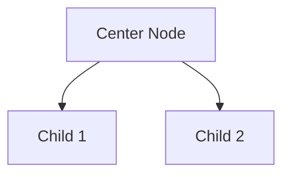

# TÍNH NĂNG MINDMAP LINKS - BÊN THỨ BA

## ✅ Đã thêm

Thay vì render mindmap trực tiếp (gây lỗi hydration), giờ tạo links đến các dịch vụ bên thứ ba để user xem mindmap online.

## 🔗 3 Dịch vụ được tích hợp

### 1. Markmap (Interactive Mindmap)
**URL**: https://markmap.js.org/repl

**Format**: Markdown
```markdown
# Center Node (Keyword chính)

## Child Node 1
## Child Node 2
## Child Node 3
```

**Ưu điểm**:
- ✅ Interactive (zoom, pan, collapse)
- ✅ Đẹp, chuyên nghiệp
- ✅ Markdown syntax đơn giản
- ✅ Miễn phí, không cần đăng ký

**Link example**:
```
https://markmap.js.org/repl#?d=# Main Topic%0A%0A## Subtopic 1%0A## Subtopic 2
```

### 2. Mermaid Live Editor (Flowchart)
**URL**: https://mermaid.live/edit

**Format**: Mermaid syntax


**Ưu điểm**:
- ✅ Flowchart style
- ✅ Nhiều layout options
- ✅ Export PNG/SVG
- ✅ Miễn phí

**Link example**:
```
https://mermaid.live/edit#pako:base64encodedstring
```

### 3. Excalidraw (Draw/Sketch)
**URL**: https://excalidraw.com

**Format**: JSON
```json
{
  "type": "excalidraw",
  "elements": [
    { "type": "ellipse", "x": 100, "y": 100, ... },
    { "type": "text", "text": "Node", ... }
  ]
}
```

**Ưu điểm**:
- ✅ Hand-drawn style
- ✅ Có thể edit sau
- ✅ Collaborative
- ✅ Miễn phí

**Link example**:
```
https://excalidraw.com/#json=encodedJSONstring
```

## 🎨 Giao diện

```
📊 Sơ đồ tư duy
┌──────────┐  ┌──────────┐
│    48    │  │   156    │
│ Entities │  │Relations │
└──────────┘  └──────────┘

🔗 Xem sơ đồ tư duy trực quan:

[🗺️ Markmap (Interactive)] [📊 Mermaid (Flowchart)] [✏️ Excalidraw (Draw)]
```

## 💻 Code Implementation

### Generate Markmap Link
```typescript
const generateMarkmapLink = (graph: any) => {
  // Find center node (most connected)
  const connectionCount = new Map<string, number>()
  graph.relations.forEach((rel: any) => {
    connectionCount.set(rel.source, count + 1)
    connectionCount.set(rel.target, count + 1)
  })
  
  const sortedEntities = [...graph.entities].sort((a, b) => 
    connectionCount.get(b.id) - connectionCount.get(a.id)
  )
  
  const centerNode = sortedEntities[0]
  const childNodes = sortedEntities.slice(1, 13)
  
  // Generate markdown
  let markdown = `# ${centerNode.label}\n\n`
  childNodes.forEach(node => {
    markdown += `## ${node.label}\n`
  })
  
  // Encode and create link
  const encoded = encodeURIComponent(markdown)
  return `https://markmap.js.org/repl#?d=${encoded}`
}
```

### Generate Mermaid Link
```typescript
const generateMermaidLink = (graph: any) => {
  let mermaid = "graph TD\n"
  
  // Add nodes (limit 15)
  const entities = graph.entities.slice(0, 15)
  entities.forEach((entity, idx) => {
    const nodeId = `N${idx}`
    const label = entity.label.substring(0, 20)
    mermaid += `  ${nodeId}["${label}"]\n`
  })
  
  // Add relations (limit 20)
  const relations = graph.relations.slice(0, 20)
  relations.forEach(rel => {
    const sourceIdx = entities.findIndex(e => e.id === rel.source)
    const targetIdx = entities.findIndex(e => e.id === rel.target)
    if (sourceIdx >= 0 && targetIdx >= 0) {
      mermaid += `  N${sourceIdx} --> N${targetIdx}\n`
    }
  })
  
  // Encode and create link
  const encoded = btoa(mermaid)
  return `https://mermaid.live/edit#pako:${encoded}`
}
```

### Generate Excalidraw Link
```typescript
const generateExcalidrawLink = (graph: any) => {
  const elements: any[] = []
  const entities = graph.entities.slice(0, 12)
  
  // Create nodes in circular layout
  const centerX = 400, centerY = 400, radius = 200
  
  entities.forEach((entity, idx) => {
    const angle = (idx / entities.length) * 2 * Math.PI
    const x = centerX + Math.cos(angle) * radius
    const y = centerY + Math.sin(angle) * radius
    
    elements.push({
      type: "ellipse",
      x: x - 50, y: y - 30,
      width: 100, height: 60,
      strokeColor: "#1e40af",
      backgroundColor: "#dbeafe",
    })
    
    elements.push({
      type: "text",
      x: x - 40, y: y - 10,
      text: entity.label.substring(0, 15),
    })
  })
  
  const excalidrawData = {
    type: "excalidraw",
    version: 2,
    elements: elements,
  }
  
  const encoded = encodeURIComponent(JSON.stringify(excalidrawData))
  return `https://excalidraw.com/#json=${encoded}`
}
```

## 🎯 Ưu điểm giải pháp này

### So với Canvas rendering
| Feature | Canvas (cũ) | External Links (mới) |
|---------|-------------|---------------------|
| Hydration error | ❌ Có | ✅ Không |
| Interactive | ❌ Không | ✅ Có |
| Zoom/Pan | ❌ Không | ✅ Có |
| Export | ❌ Không | ✅ PNG/SVG |
| Edit | ❌ Không | ✅ Có (Excalidraw) |
| Collaborative | ❌ Không | ✅ Có (Excalidraw) |
| Maintenance | ❌ Phức tạp | ✅ Đơn giản |

### Lợi ích
1. ✅ **Không lỗi hydration**: Chỉ là links, không render
2. ✅ **Interactive**: User có thể zoom, pan, collapse
3. ✅ **Professional**: Dịch vụ chuyên nghiệp, đẹp
4. ✅ **No maintenance**: Không cần maintain code render
5. ✅ **Multiple options**: User chọn tool họ thích
6. ✅ **Export**: User có thể export PNG/SVG
7. ✅ **Edit**: User có thể edit trên Excalidraw

## 📱 User Experience

### Flow
1. User upload file
2. Thấy stats: "48 Entities, 156 Relations"
3. Thấy 3 buttons: Markmap, Mermaid, Excalidraw
4. Click button → Mở tab mới
5. Xem mindmap interactive
6. Zoom, pan, explore
7. Export nếu muốn

### Example
```
User: Upload "Climate Change.pdf"
↓
System: Extract 48 entities, 156 relations
↓
User: Click "🗺️ Markmap (Interactive)"
↓
Browser: Open https://markmap.js.org/repl#?d=...
↓
User: See interactive mindmap
      - Center: "climate change"
      - Children: "global warming", "carbon emissions", ...
↓
User: Zoom in, explore, export PNG
```

## 🚀 Deploy

### Files modified
1. ✅ `app/dashboard-new/documents/page.tsx`
   - Added 3 generate functions
   - Added 3 link buttons
   - Updated UI

2. ✅ `app/dashboard-new/documents-simple/page.tsx`
   - Same changes (keep in sync)

### Commit
```bash
git add app/dashboard-new/documents/page.tsx
git add app/dashboard-new/documents-simple/page.tsx
git add MINDMAP_LINKS_FEATURE.md
git commit -m "feat: Add external mindmap links (Markmap, Mermaid, Excalidraw)"
git push origin main
```

## ✅ Test

Sau khi deploy:

- [ ] Upload file
- [ ] Thấy "📊 Sơ đồ tư duy" section
- [ ] Thấy 3 buttons: Markmap, Mermaid, Excalidraw
- [ ] Click Markmap → Mở tab mới → Thấy mindmap
- [ ] Click Mermaid → Mở tab mới → Thấy flowchart
- [ ] Click Excalidraw → Mở tab mới → Thấy diagram
- [ ] Mindmap có center node và child nodes
- [ ] Có thể zoom, pan (Markmap)
- [ ] Có thể export (Mermaid)
- [ ] Có thể edit (Excalidraw)

## 💡 Tips

### Markmap
- Best cho mindmap truyền thống
- Interactive nhất
- Đẹp nhất

### Mermaid
- Best cho flowchart/diagram
- Nhiều layout options
- Export PNG/SVG dễ

### Excalidraw
- Best cho hand-drawn style
- Có thể edit sau
- Collaborative

### Khuyến nghị
- **Học từ vựng**: Dùng Markmap (mindmap style)
- **Phân tích logic**: Dùng Mermaid (flowchart)
- **Brainstorm**: Dùng Excalidraw (sketch)

---

**Status**: ✅ IMPLEMENTED
**Deploy**: Ready to push
**Test**: Verify all 3 links work correctly
